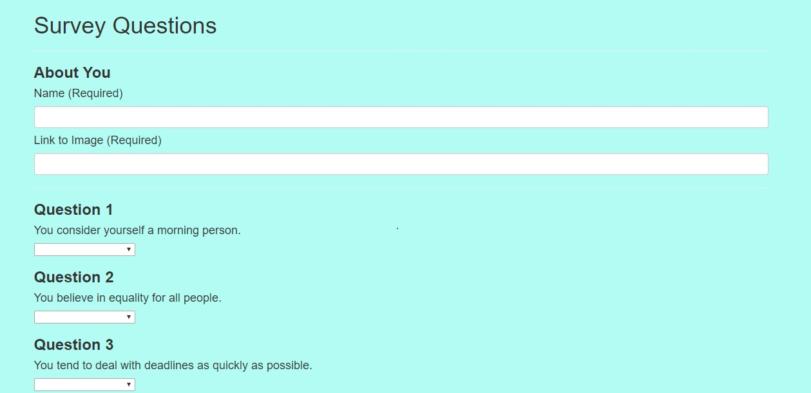
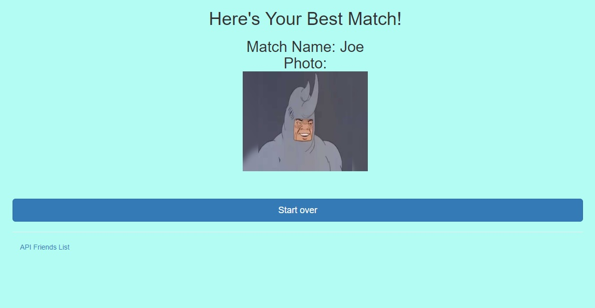

## Friend-Finder

This is an app which runs in node using express and is hosted on heroku. It is meant to function as an app to identify people with similar personality traits to the user. It is now up and running.

# Deployed App
The app is now up and running and can be accessed at https://friend-finder112.herokuapp.com/.

# Dependencies 

This app reqires express.js, as well as several packages via NPM (see package.json).

# Visuals

Home Page:

Survey:

Results:

# Future Development

Further features may be added to expand functionality in the near future. Persistent data storage would be a primary feature to be added in the next stage of development, as well as some more dynamic style features beyond the base functionality of the app.
